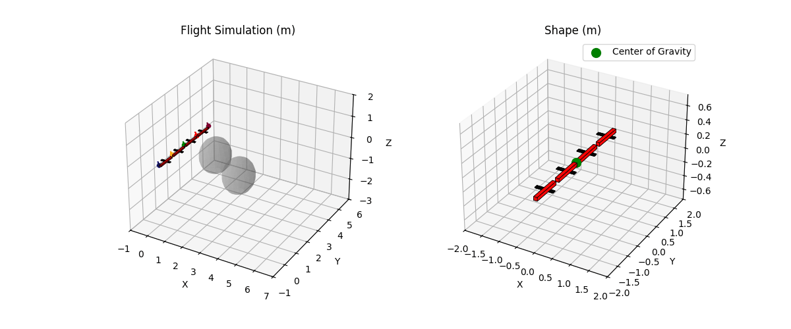

# ADMM-based Distributed MPC for Modular Articulated Aerial Robots

State-of-the-art articulated modular aerial robots provide versatility in wrench execution and aerial manipulation through customizable shape formations and vectorizable thrust control. The DRAGON robot is one of these systems, comprised of four modules interlinked with two-DoF joints for custom shape selection and a vectoring apparatus on each module for precise thrust control. Nevertheless, the high number of degrees of freedom makes centralized model-based planning and control mechanisms computationally heavy and fundamentally unscalable. In this paper, we propose a decentralized, distributed, scalable solution for path planning that spreads the computational load across all modules by treating them as independent, rigidly linked drones and solving a distributed, constrained MPC problem with ADMM.

  
  
  
  
  

# Distributed Thrust Allocation for Wrench Control

  

  <h2>Open Loop Thrust</h2>
  

  

  <h2>Distributed Thrust Allocation</h2>
  

  
  

## More examples

  
  
  

